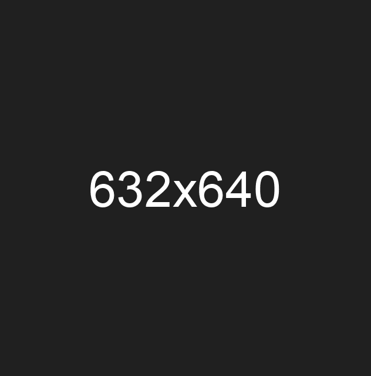

# OVERVIEW

This post-installation script prepares an [Ubuntu](https://ubuntu.com/download/server) server for [Dokploy](https://dokploy.com/) by updating and configuring the system, installing required dependencies, and setting up [CrowdSec](https://www.crowdsec.net/) for security and intrusion prevention. It is ideal for cheap deployments and tailored for solo developers seeking a simple, secure, and efficient setup.

<hr>

### Script Previews



<hr>

# GUIDANCE

### Getting Started

Blindly executing this is strongly discouraged.

```shell
curl -fsSL https://raw.githubusercontent.com/olankens/doksetup/HEAD/src/ubuntu.sh | bash
```
